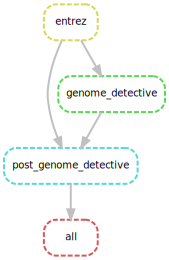
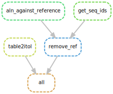
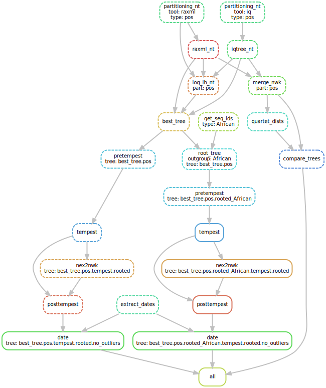
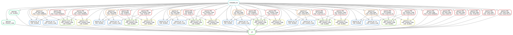

# ML analysis of Zika data

This folder contains a Snakemake [[Köster *et al.*, 2012](https://doi.org/10.1093/bioinformatics/bts480)] pipeline 
for reconstruction of evolutionary history of Zika.

The pipeline steps are detailed below.

## Pipeline

### 0. Input data
The input data are Zika sequences genbank_20190325_org_Zika_virus_len_8000_14000.fa located in the data folder.

They were downloaded from GenBank [[Benson *et al.* 2013](https://www.ncbi.nlm.nih.gov/pubmed/23193287)] 
on 2019/03/25 with the keywords: organism “Zika virus”, and sequence length between 8000-14000 (full genome).


### 1. Metadata
#### Sampling dates and countries
The input sequences are annotated with the collection_date and country using Entrez [[NCBI Resource Coordinators 2012](https://www.ncbi.nlm.nih.gov/pmc/articles/PMC3531099/)]. 

#### Serotypes and genotypes
The sequences were typed with Genome Detective [[Vilsker *et al.* 2019](https://academic.oup.com/bioinformatics/advance-article-abstract/doi/10.1093/bioinformatics/bty695/5075035)],
and those with the type support < 1000 removed.

#### DIY

The metadata extraction pipeline Snakefile_metadata 
is avalable in the snakemake folder and can be rerun as (from the snakemake folder):
```bash
snakemake --snakefile Snakefile_metadata --keep-going --config folder=.. --use-singularity -singularity-args "--home ~"
```



### 2. Sequence alignment

The sequences were aligned against the reference [[Theys *et al.* 2017](https://journals.plos.org/plospathogens/article?id=10.1371/journal.ppat.1006528)] (which was then removed from the alignment) 
with MAFFT [[Katoh and Standley 2013](https://academic.oup.com/mbe/article/30/4/772/1073398)]. 

#### DIY
The sequence alignment pipeline Snakefile_alignment is avalable in the snakemake folder and can be rerun as (from the snakemake folder):
```bash
snakemake --snakefile Snakefile_alignment --keep-going --config folder=.. --use-singularity -singularity-args "--home ~"
```


### 2. Tree reconstruction
We reconstructed a maximum likelihood tree from the DNA sequences using partitioning into two groups: positions 1-2, and 3.
The tree reconstruction was performed with 2 ML tools allowing for partitioning (GTRGAMMA+G6+I): 
RAxML-NG [[Stamatakis, 2014](https://doi.org/10.1093/bioinformatics/btu033)] and IQ-TREE [[Nguyen *et al.*, 2015](https://doi.org/10.1093/molbev/msu300)], 
resulting in 2 trees with different topologies, the better tree (in terms of likelihood) was then selected.

For each tree the root-to-tip regression was performed with TepmEst [[Rambaut *et al.* 2016](https://www.ncbi.nlm.nih.gov/pmc/articles/PMC4989882/)], 
and the temporal outliers and tips without dates were removed from the tree, 
which was then dated and rooted (based on dates) with LSD [[To *et al.*, 2015](https://academic.oup.com/sysbio/article/65/1/82/2461506)]. 

#### DIY
The tree reconstruction pipeline Snakefile_trees is avalable in the snakemake folder and can be rerun as (from the snakemake folder):
```bash
snakemake --snakefile Snakefile_trees --keep-going --config folder=.. --use-singularity -singularity-args "--home ~"
```


### 3. Ancestral character reconstruction (ACR)
We reconstruct ACR for country_code, location and continent using PastML [[Ishikawa *et al.*, 2018](https://doi.org/10.1101/379529)].

 
#### DIY
To perform ACR on the reconstructed trees, from the snakemake folder, run the Snakefile_acr pipeline:
```bash
snakemake --snakefile Snakefile_acr --keep-going --config folder=.. --use-singularity --singularity-args "--home ~"
```


