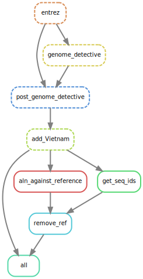
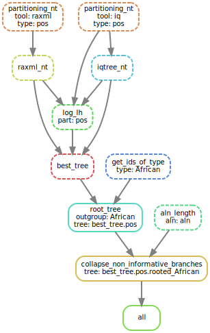

# ML analysis of Zika data

This folder contains Snakemake [[Köster *et al.*, 2012](https://doi.org/10.1093/bioinformatics/bts480)] pipelines
for reconstruction of evolutionary history of Zika.

The pipeline steps are detailed below.

## Pipeline

### 0. Input data
The input data should be located in the [data](data) folder and contain (1) Vietnamese sequences in a file Vietnam.fa (not provided)
and (2) [genbank_20200811_org_Zika_virus_len_8000_14000.fa](data/genbank_20200811_org_Zika_virus_len_8000_14000.fa) sequences (provided), 
which were downloaded from GenBank [[Benson *et al.* 2013](https://www.ncbi.nlm.nih.gov/pubmed/23193287)] 
on 2020/08/11 with the keywords: organism “Zika virus”, and sequence length between 8000-14000 (full genome).


### 1. Metadata and MSA
#### Sampling dates and countries
The input GenBank sequences were annotated with the collection_date and country 
using Entrez [[NCBI Resource Coordinators 2012](https://www.ncbi.nlm.nih.gov/pmc/articles/PMC3531099/)]. 

#### Types
The sequences were typed (African vs Asian) with Genome Detective [[Vilsker *et al.* 2019](https://academic.oup.com/bioinformatics/advance-article-abstract/doi/10.1093/bioinformatics/bty695/5075035)],
and those with the type support < 100 removed.

### MSA

The sequences were aligned against the reference [[Theys *et al.* 2017](https://journals.plos.org/plospathogens/article?id=10.1371/journal.ppat.1006528)] (which was then removed from the alignment) 
with MAFFT [[Katoh and Standley 2013](https://academic.oup.com/mbe/article/30/4/772/1073398)]. 

#### DIY

The metadata extraction, sequence combining and alignment pipeline [Snakefile_combined_MSA](snakemake/Snakefile_combined_MSA)
is avalable in the [snakemake](snakemake) folder and can be rerun as (from the snakemake folder):
```bash
snakemake --snakefile Snakefile_combined_MSA --keep-going --config folder=.. --use-singularity -singularity-args "--home ~"
```



### 2. Phylogeny reconstruction
We reconstructed a maximum likelihood tree from the DNA sequences using partitioning into two groups: positions 1-2, and 3.
The tree reconstruction was performed with 2 ML tools allowing for partitioning (GTRGAMMA+G6+I): 
RAxML-NG [[Stamatakis, 2014](https://doi.org/10.1093/bioinformatics/btu033)] and IQ-TREE 2 [[Minh *et al.*, 2020](https://doi.org/10.1093/molbev/msaa015)], 
resulting in 2 trees with different topologies, the better tree (in terms of likelihood) was then selected.

The non-informative branches (<= 1/2 mutation) were then collapsed and the tree was rooted with the African outgroup (removed).

#### DIY
The phylogeny reconstruction pipeline [Snakefile_phylogeny](snakemake/Snakefile_phylogeny) is avalable in the [snakemake](snakemake) folder and can be rerun as (from the snakemake folder):
```bash
snakemake --snakefile Snakefile_phylogeny --keep-going --config folder=.. --use-singularity -singularity-args "--home ~"
```


### 3. Phylogeography
The phylogeny was dated with LSD 2 [[To *et al.*, 2015](https://academic.oup.com/sysbio/article/65/1/82/2461506)] (with temporal outlier removal).
We then reconstructed ancestral characters for country using PastML [[Ishikawa *et al.*, 2018](https://doi.org/10.1101/379529)].

 
#### DIY
To perform phylogeographic analysis, from the [snakemake](snakemake)folder, run the [Snakefile_phylogeography](snakemake/Snakefile_phylogeography) pipeline:
```bash
snakemake --snakefile Snakefile_phylogeography --keep-going --config folder=.. --use-singularity --singularity-args "--home ~"
```


